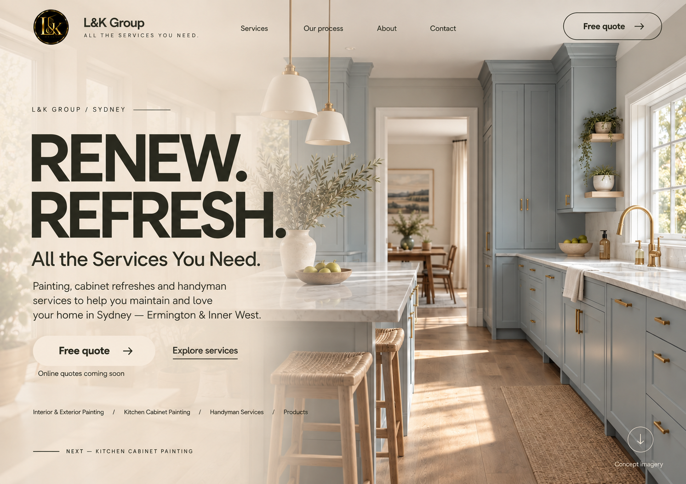

# Concept 1 — Olive / Ivory 시안 v4

2026-09-28 · 사용자 요청: `concept 1.png`를 직전 시안처럼 수정하기. 구현 전 시안이며 최종 승인·웹 적용 완료가 아니다.



## 반영 방향

- [concept 1](../../concept%201.png)의 주방 사진 특징(중앙 출입구, 오른쪽 창·싱크·회청색 캐비넷, 왼쪽 아일랜드·스툴)과 `RENEW. REFRESH.` 제목·본문을 유지하는 방향으로 재구성했다.
- [직전 v3](home-olive-ivory-v3.md)의 전체 사진 배경, 반투명 웜 아이보리 레이어, 짙은 올리브 차콜 글자, 사진 위 내비게이션·CTA 방식을 적용했다.
- 기존 분할 패널과 불투명 하단 띠를 제거했다. 원본 파일은 보존했다.
- 생성 도구가 사진을 확장·재구성했으므로 원본 사진의 픽셀 단위 복사본은 아니다.
- 색상 방향: 올리브 차콜 `#30372F`, 웜 아이보리 `#F4EFE5`. 사진 고유의 캐비넷·목재·황동 색상은 유지했다.

## 제작·확인 범위

- 기본 내장 `image_gen` 사용. 입력은 원본 concept 1과 v3 스타일 참조 두 장이다.
- 결과의 주방 특징·전체 사진 배경·제목·본문·컨셉 표시를 시각적으로 확인했다.
- 코드·기능은 변경하지 않았다. 반응형·브라우저·접근성 검증 완료를 뜻하지 않는다.
- `Online quotes coming soon`, `Concept imagery` 표기를 유지했다.

## 최종 생성 프롬프트

```text
Use case: style-transfer / compositing.
Make ONE polished desktop homepage mockup by restyling reference image 1 (concept 1.png) to match the most recent design in reference image 2 (home-olive-ivory-v3.png). Output a single flat website screenshot, approx 1500 x 1060 landscape. No device or presentation frame.

REFERENCE ROLES:
Image 1 is the CONTENT AND PHOTOGRAPH SOURCE: preserve its "RENEW. REFRESH." wording, service description and distinctive kitchen. Use this specific kitchen, with pale blue-gray traditional shaker cabinetry, tall cabinets beside the CENTRAL OPEN DOORWAY into a dining room, windows and sink along the RIGHT wall, brass tap and handles, white marble worktops, island and woven stools to the LEFT, oak floor and long natural-fiber runner. Preserve this photographed perspective looking along the walkway. Do not replace it with a frontal cabinet wall, the second reference's kitchen, or a new kitchen.
Image 2 is ONLY THE DESIGN STYLE AND LAYOUT reference: a continuous edge-to-edge photographic background beneath the entire interface, softly translucent warm ivory/beige wash, dark olive-charcoal typography, transparent header, large editorial heading over the left half, fine rules, refined pill buttons, and small footer links over the photo.

TRANSFORMATION:
Take the kitchen photograph from image1 and extend/outpaint it into a full-width full-height scene. Eliminate image1's opaque left panel, hard vertical split, separate header background, and solid dark lower band. The SAME kitchen photograph must be visible behind all interface elements, including the header, headline and footer. Keep the distinctive central doorway, right-hand windows/sink/cabinetry and left island visibly recognizable toward center and right. Extend naturally toward the left to make room for text; do not stretch the existing photo.
Apply a warm ivory translucent veil #F4EFE5, stronger behind left-hand copy, fading smoothly to a lighter transparent wash at right, exactly the tasteful treatment of image2. Photography must show through even on the left. NO opaque rectangular box, split columns, frosted card or dark-blue background.

COLOR:
Every UI label, headline, body, icon, rule and button outline is DEEP OLIVE CHARCOAL #30372F as in image2. No blue lettering. The kitchen's original pale blue-gray cabinetry remains unchanged and natural. Button surfaces are warm ivory. Preserve the original circular black/gold brand logo, as the only brand-color exception. Warm daylight and natural materials.

LAYOUT / CONTENT:
- Transparent top header over the photograph: original circular L&K logo at upper left, "L&K Group" wordmark and small "ALL THE SERVICES YOU NEED." next to it, navigation "Services", "Our process", "About", "Contact", outlined "Free quote" pill with right arrow at far right.
- Left copy at about 4% inset. Eyebrow "L&K GROUP / SYDNEY" and delicate rule.
- Large bold clean sans-serif heading, two lines, verbatim:
"RENEW."
"REFRESH."
Keep reference1's commanding uppercase wording, rendered in reference2's deep olive-charcoal color. Around the same height as image2's headline, with comfortable margins.
- Subheading "All the Services You Need."
- Readable body in three/four lines: "Painting, cabinet refreshes and handyman services to help you maintain and love your home in Sydney — Ermington & Inner West."
- Warm ivory pill "Free quote" with dark olive arrow, and underlined "Explore services" to its right.
- Small note beneath CTA: "Online quotes coming soon".
- Small bottom service links: "Interior & Exterior Painting / Kitchen Cabinet Painting / Handyman Services / Products". Keep them legible and away from clipping.
- Subtle lower-left thin rule and text "NEXT — KITCHEN CABINET PAINTING". No filled band behind this.
- Bottom right down arrow and small caption "Concept imagery".

Preserve all text spelling. Keep text over the photo, maintain hierarchy and generous breathing room, show right-side cabinetry clearly. This is the first concept's kitchen and headline reinterpreted in the latest olive-and-ivory FULL-PHOTO design. Do not reproduce reference2's "Good spaces. Made fresh." title or frontal island photograph. No added pricing, phone numbers, testimonials or credentials. Output only the revised image.
```

