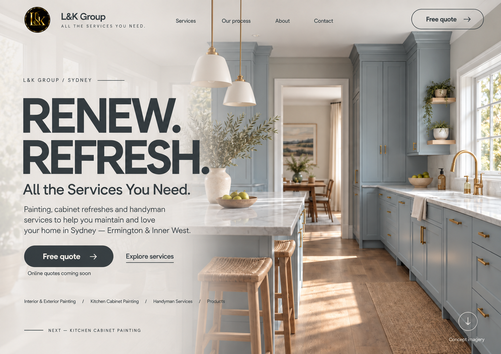

# Concept 1 — Slate / Greige 시안 v5

2026-09-28 · 사용자 요청: 사진의 캐비넷·배경·글자 색을 함께 고려해 전문적인 관점에서 색상을 다시 선택하기. 구현 전 이미지 시안이다.



## 색상 판단

현재 사진은 청회색 계열 캐비넷·회색 대리석과 따뜻한 목재·황동·햇빛을 함께 갖는다. 직전 세이지 주방용 올리브 팔레트를 그대로 적용하면 캐비넷과 글자의 색조가 어긋나고, 노란 베이지 레이어가 이를 강조한다. 캐비넷과 같은 낮은 채도의 회색 계열로 글자를 묶고 따뜻함은 사진의 재료에 맡긴다.

| 역할 | 제안값 | 적용 이유 |
| --- | --- | --- |
| 제목·내비게이션·작은 글자·선 | `#2E3A3F` 슬레이트 차콜 | 캐비넷의 회청색과 연결하면서 명도로 구분 |
| 본문 | `#465156` 슬레이트 그레이 | 밝은 레이어 위에서 제목보다 부드럽게 표현 |
| 왼쪽 반투명 레이어 | `#F1EFE9` 밝은 그레이지 | 기존 노란 기를 줄이고 대리석·벽과 연결 |
| 주요 버튼 배경 | `#2E3A3F` | 밝은 화면에서 CTA 구분 |
| 주요 버튼 글자 | `#FAF8F3` 소프트 아이보리 | 버튼 안의 읽기 대비 확보 |

- 상단 CTA는 외곽선, 본문 CTA는 채움으로 위계를 준다.
- 작은 안내·서비스 링크는 더 밝은 본문색 대신 짙은 슬레이트를 사용한다.
- 원본 캐비넷·목재·황동·검정/금색 로고를 보존하는 방향으로 편집했다. 생성 편집이므로 사진 픽셀의 동일성을 보장하지 않는다.
- 새 금색 UI 포인트를 추가하지 않는다. 원본 사진과 로고의 금속 색만 유지한다.
- 전체 사진 배경과 제목·본문·레이아웃은 [v4](concept-1-olive-ivory-v4.md)를 기준으로 유지한다.

## 제작·검증 범위

- 기본 내장 `image_gen`으로 기존 시안의 팔레트를 편집했다.
- 별도 디자인 검토에서 슬레이트·그레이지 조합과 CTA 위계를 확인했다. 생성 후 레이어의 노란 기 감소, 제목·본문의 회색 계열, 진한 CTA, 문구·구도를 눈으로 확인했다.
- 단색 토큰끼리 계산한 대비: 제목/배경 10.18:1, 본문/배경 7.10:1, 버튼 글자/배경 11.03:1.
- 위 수치는 제안한 HEX 단색 조합의 계산이다. 생성 이미지의 픽셀·사진 위 반투명 합성·실제 앱 접근성 검사 결과가 아니다. 구현 시 화면 폭·사진 크롭·실제 합성 배경별로 다시 검증한다.
- 웹페이지 코드·기능은 변경하지 않았다. 시안 승인·실제 앱 QA 완료를 뜻하지 않는다.
- 원본과 이전 버전은 보존했다.

## 최종 생성 프롬프트

```text
Use case: precise-object-edit / professional website palette refinement.
Edit ONLY THE UI COLOR SYSTEM and translucent overlay color of the supplied L&K Group hero mockup. Produce ONE full-size revised image with identical composition and text. This is a subtle, senior art-directed color correction, not a redesign.

DESIGN REASON:
This particular photograph has low-saturation blue-gray cabinetry, cool marble, warm timber, warm daylight and brass. The previous olive-black text and strongly yellow-beige veil compete with those materials. Create harmony using a very LOW-CHROMA SLATE CHARCOAL tied to the cabinetry and a light limestone/greige veil. It must not return to saturated navy-blue, teal, olive green or sepia. Natural photo materials provide the warmth.

NEW PALETTE / EXACT ROLES:
1. Headline "RENEW. REFRESH.", logo wordmark, navigation, eyebrow, subtitle, small service links, small notes, linework, arrows and outlined header CTA: low-chroma slate charcoal #2E3A3F. This should look like charcoal gray with a subtle cool blue-gray undertone, NOT obviously blue.
2. Main descriptive paragraph: dark slate gray #465156, only where the bright translucent veil makes it readable. Keep small notes in darker #2E3A3F, not faint gray.
3. Translucent left readability veil: warm limestone / very light neutral greige #F1EFE9. REMOVE the heavy yellow/peach tint and olive tint of the existing left overlay. Preserve warmth without looking yellow. Smoothly fade this light greige veil across the left text area toward transparent at center-right. The kitchen must remain visibly continuous behind the text. This is not an opaque panel, not a split, no white rectangular card.
4. Main lower-left "Free quote" pill: fill with SOLID SLATE CHARCOAL #2E3A3F; its text and arrow become soft ivory #FAF8F3. Keep the current exact dimensions, shape, position and arrow geometry. This is the ONE intentional dark filled UI element. It should be the clear primary action.
5. Header "Free quote" remains a fine slate outline with transparent fill and slate text. "Explore services" remains dark slate underlined text without a filled box.
6. Preserve original BLACK AND GOLD circular logo. Preserve all naturally occurring brass in the photo. Do not add gold UI lines, gold text or gold buttons.
7. The small bottom-right "Concept imagery" and existing circular down arrow may remain soft ivory for legibility over the darker photographic floor/cabinet. Everything else follows the roles above.

STRICT INVARIANTS:
Keep the exact same existing kitchen photograph: blue-gray traditional shaker cabinets, central doorway into a dining room, right windows and sink with brass tap, white marble worktops, island and woven stools on the left, oak floor and runner. DO NOT recolor the cabinet paint, change the room lighting, warm/cool the entire photo globally, remove details, reconstruct perspective, add furniture, or replace the photo. Only change the overlay and UI palette. Keep the source aspect ratio about 1492x1054 and all text/positions/fonts/sizes/line breaks, the full-bleed photograph background, transparent header, and all layout. Preserve original heading uppercase. No split panel, no opaque header strip, no new elements.

PRESERVE ALL COPY VERBATIM:
"L&K Group"
"ALL THE SERVICES YOU NEED."
"Services" "Our process" "About" "Contact" "Free quote"
"L&K GROUP / SYDNEY"
"RENEW."
"REFRESH."
"All the Services You Need."
"Painting, cabinet refreshes and handyman services to help you maintain and love your home in Sydney — Ermington & Inner West."
"Explore services"
"Online quotes coming soon"
"Interior & Exterior Painting / Kitchen Cabinet Painting / Handyman Services / Products"
"NEXT — KITCHEN CABINET PAINTING"
"Concept imagery"

Quality: crisp, restrained and realistic. Confident neutral color hierarchy, legible on the photographic background. Preserve photo highlights and material textures on the right; lift/neutralize only the existing left overlay. Output the single revised website image only, no swatches, labels, before-after, framing or added content.
```

