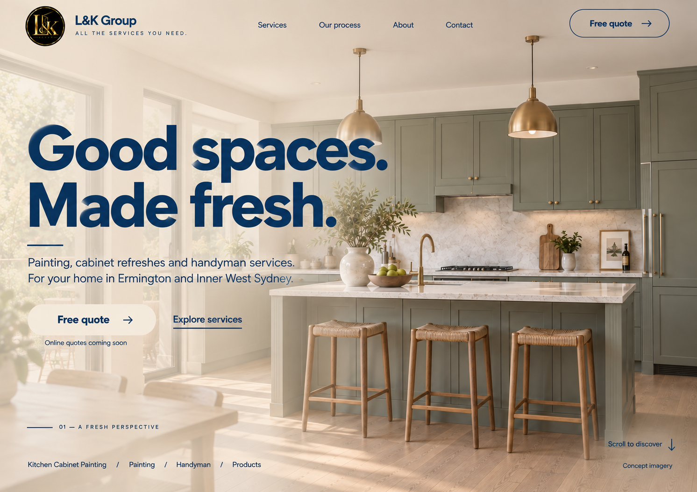

# 메인 첫 화면 — Blue / Beige 시안 v2

2026-09-28 · 구현 전 이미지 검토 단계. v1 이후 사용자 수정 요청을 반영했다. 웹페이지 구현·최종 승인 완료를 뜻하지 않는다.



## 최신 요청과 반영

- 모든 UI 글자를 파란색으로 변경하고, 베이지색 반투명 레이어를 적용했다.
- 기존 좌우 분할을 교체해 [concept 3](../../concept%203.png)처럼 사진을 화면 전체 배경으로 배치했다. 메뉴·제목·설명·CTA·하단 서비스 링크가 사진 위에 겹친다.
- [concept 2](../../concept%202.png)의 캐비넷 정면·아일랜드·스툴 3개 구도를 유지하는 방향으로 생성 도구가 재구성했다. 원본의 픽셀 단위 추출본은 아니다.
- 글자 뒤 베이지 레이어는 더 진하게, 오른쪽 사진 영역은 더 투명하게 처리했다. 독립된 불투명 텍스트 패널은 제거했다.
- 딥 블루 제안값 `#153B63`, 웜 베이지 제안값 `#E9DFCF`. 래스터 생성 결과의 실제 색은 제안값과 다를 수 있으며, 구현 시 토큰·대비를 별도 검증한다.
- 기존 검정·금색 브랜드 로고를 유지했다. `Concept imagery`, `Online quotes coming soon` 표기를 포함했다.
- 이전 [v1](home-blue-ivory-v1.md)은 비교용으로 보존한다. 최신 요청에서 구성 기준은 v1의 분할 배치에서 v2의 전체 배경 사진으로 변경됐다.

## 산출물과 검증 범위

- 파일: `home-blue-beige-v2.png`
- 생성 방식: 기본 내장 `image_gen`, 참조 이미지 3개 사용.
- 시각 확인: 전체 배경 사진, 파란색 글자, 베이지 반투명 처리, 정면 캐비넷과 스툴 3개, 제목·메뉴·버튼 문구.
- 웹페이지 코드와 기능은 변경하지 않았다. 앱 테스트·반응형·접근성 통과를 뜻하지 않는다.
- 시안의 투명도는 사진 위 레이어 표현이다. PNG 자체의 배경 제거·알파 투명도 요청이 아니다.
- 후속 구현에서는 회사 원본 로고와 HTML 텍스트를 사용하며 Free Quote 기능은 별도 요청 전까지 비활성으로 유지한다.

## 최종 생성 프롬프트

```text
Use case: ui-mockup / compositing revision.
Create ONE revised high-fidelity desktop homepage hero mockup for L&K Group, landscape approx 1500 x 1060. This is a flat website screenshot concept, no browser chrome, no device, no presentation board. Apply the user's newest correction precisely: ALL UI TEXT IS DEEP BLUE, the surface treatment is WARM BEIGE, and one continuous KITCHEN PHOTO fills the ENTIRE canvas edge to edge BEHIND the typography, header, and footer.

Input roles:
1. home-blue-ivory-v1.png is the previous mockup. Keep its L&K identity, copy, refined buttons and overall content. REPLACE its split layout and opaque blue panel completely. There must be NO blue background block, no two-column boundary, no separate ivory header strip, no opaque panel behind the headline, no left-only bottom band.
2. concept 2.png supplies the PHOTO SUBJECT. Reuse the recognizable FRONT-FACING kitchen: sage-gray shaker cabinet wall, marble backsplash and island, three woven wooden stools aligned in front, two brass pendant lights, brass tap, light oak floor, natural light from a window/door at left. Preserve this front-on camera view and details. Remove all lettering originally overlaid in that reference. Expand/recompose to a continuous full-height background including behind all text. Keep the front island and the three stools clearly recognizable toward center/right. Do not substitute the angled dark kitchen from reference3.
3. concept 3.png is the new LAYOUT AND STYLE MASTER: continuous full-bleed photo, transparent integrated top navigation, oversize two-line heading over the left part of the photo, body and CTA over the photo below, delicate bottom service navigation over the photo, open space at right. Follow these reference3 proportions. Translate its white-on-dark treatment to BLUE-ON-TRANSLUCENT-BEIGE.

Color and transparency:
Every visible UI text, all headline/body/nav/category labels, divider rules and arrow icons are a rich deep true blue #153B63. Warm sand-beige #E9DFCF is the surface palette.
A smooth transparent warm-beige veil covers the background photo, approximately 55-65% over the left text area, gently fading to 20-30% on the right. The photograph must remain visibly present behind the letters on the left: show kitchen outlines and natural materials through the veil. It is ONE connected background, no vertical split, no rectangular text box, no frosted-glass card, no opaque flat patch. Soften busy photographic detail under the text just enough for confident blue text readability. Header also sits directly on the photograph with a light translucent beige treatment, no separate visible bar. Premium calm natural residential look; not dark, not gray monochrome, not washed out beyond recognition.
Preserve the small original circular black/gold brand logo as a brand-only exception. No other gold UI accents. Realistic kitchen material colors may remain natural.

Layout and exact text:
- Transparent integrated header: circular existing L&K logo + blue "L&K Group" at upper left; small blue letterspaced tagline "ALL THE SERVICES YOU NEED." under wordmark. Across top middle blue links "Services", "Our process", "About", "Contact". Top right thin blue outlined transparent/beige pill "Free quote" and right arrow.
- Left margin about 4% of canvas. Headline begins around 24% from top. Huge bold clean sans-serif deep blue headline, in exactly two lines: "Good spaces." then "Made fresh." Match reference3 scale and confident font weight, approximately 55% total canvas width. Text is directly over the background photo and beige veil.
- Below headline, a short fine blue horizontal rule then two or three readable blue lines: "Painting, cabinet refreshes and handyman services." followed by "For your home in Ermington and Inner West Sydney."
- Large beige-filled semi-transparent pill with blue text "Free quote" and blue arrow at left beneath body. Beside it blue underlined "Explore services". Under quote CTA a small blue note "Online quotes coming soon". Keep generous breathing room.
- Lower left: a fine blue rule and restrained tracked text "01 — A FRESH PERSPECTIVE".
- Along bottom left in deep blue: "Kitchen Cabinet Painting / Painting / Handyman / Products".
- Bottom right small blue "Scroll to discover" and thin down arrow; beneath small blue "Concept imagery".
- Preserve empty breathing room at right so the cabinet front, island and stools are easy to see. No extra content panels, no next-section card, no blue solid regions.

Text must be clean English with exact spelling. All UI copy BLUE, never white. Photography behind ALL screen areas, even header and headline. The beige is a translucent overlay, never a separate left background panel. No fictional reviews, pricing, phone, email, credentials or new installations claims. Produce only the one revised website image.
```

