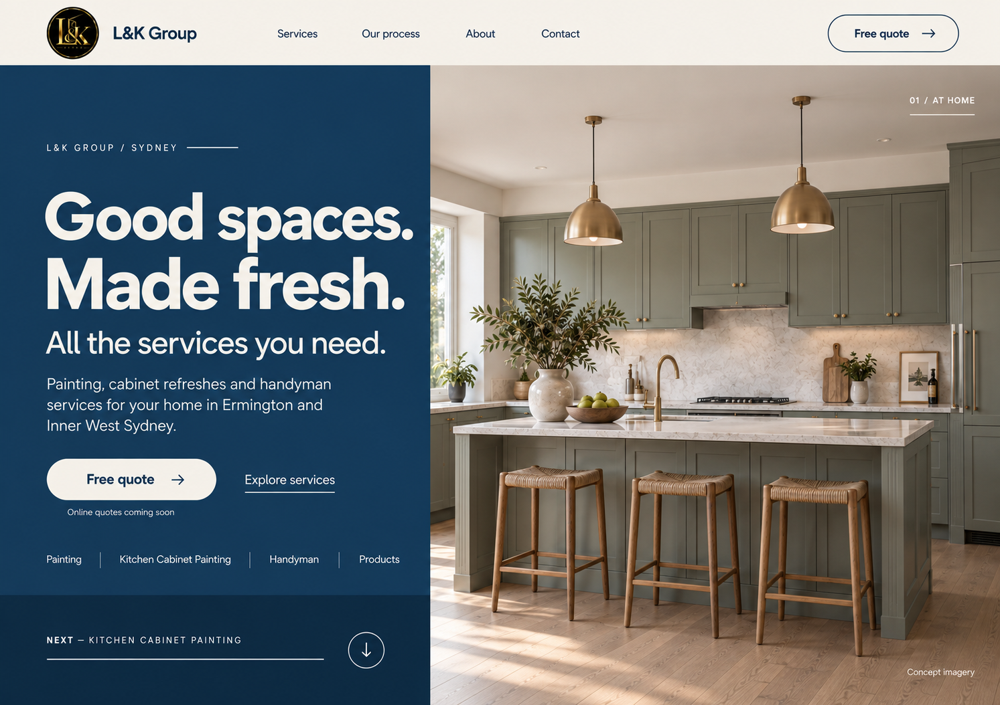

# 메인 첫 화면 — Blue / Ivory 시안 v1

2026-09-28 · 구현 전 이미지 검토 단계. 사용자 요청으로 생성한 합성 시안이며 최종 구현 승인을 뜻하지 않는다.



## 요청 반영

- 구성: [concept 1](../../concept%201.png)의 전체 폭 헤더, 좌측 소개·CTA·서비스 목록, 우측 큰 사진, 좌측 하단 다음 섹션 띠.
- 사진: [concept 2](../../concept%202.png)의 캐비넷 정면·아일랜드·스툴 3개 구도를 세로 영역에 맞춰 생성 도구로 재구성. 원본 사진의 픽셀 단위 추출본이 아니다.
- 디자인: [concept 3](../../concept%203.png)의 대형 굵은 타이포, 아이보리 글자, pill CTA, 가는 구분선.
- 사용자 지정 색상: 파란색과 아이보리. 시안 제안값은 딥 블루 `#153B63`, 아이보리 `#F4F0E6`. 실제 구현 시 디자인 토큰과 색 대비를 별도 검증한다.
- 기존 검정·금색 로고는 브랜드 예외로 유지하고, 주방은 자연스러운 원래 계열 색상을 유지했다.
- `Concept imagery`, `Online quotes coming soon` 표시. 실제 시공 증거·온라인 견적 접수 화면이 아니다.

## 산출물과 확인 범위

- 파일: `home-blue-ivory-v1.png`
- 생성 방식: 기본 내장 `image_gen`, 참조 이미지 3개 사용.
- 생성 결과를 눈으로 확인했다: 좌우 분할, 정면 캐비넷·아일랜드·스툴 3개, 블루·아이보리, 텍스트·CTA·컨셉 표기.
- 웹페이지 코드·기능은 변경하지 않았다. 브라우저 QA·반응형·실제 접근성 검증을 수행한 산출물이 아니다.
- 후속 구현 시 로고는 회사 원본 자산, 텍스트는 HTML로 적용한다. 이미지 속 내비게이션·화살표는 시각적 표현이며 동작 구현 범위의 확정이 아니다.

## 최종 생성 프롬프트

```text
Use case: ui-mockup.
Create ONE polished desktop website hero concept image for L&K Group. This is a flat screen design preview, not browser chrome, not a device mockup, no collage or multiple alternatives. Landscape aspect ratio approximately 1487:1058, ideally 1792x1280 or similar.

Reference roles and priority:
Image 1 (concept 1.png) is the COMPOSITION MASTER. Preserve its full-width shallow top navigation, asymmetrical split hero (about 43% left text, 57% right tall photo), title/description/two CTAs in left panel, small service-category row near its lower edge, and left-only next-section band at the bottom. The right photo fills the entire hero height. These structural positions are non-negotiable.
Image 2 (concept 2.png) provides ONLY THE KITCHEN PHOTOGRAPH: use the recognizably same straight-on/front-facing shaker cabinet wall, marble backsplash, island with three woven stools, brass pendants and taps, pale oak floor, and daylight from the left. Preserve its sage-gray cabinet finishes and natural ivory surfaces. Reframe the kitchen into the right tall panel so the front cabinet wall AND three stools remain visible: use the kitchen's front elevation, not a diagonal galley or a newly invented kitchen. Cleanly remove all lettering and UI that were superimposed on the original photograph. Do not copy image 2's page layout.
Image 3 (concept 3.png) provides THE VISUAL DESIGN LANGUAGE: dramatic large bold contemporary sans-serif typography, confident editorial spacing, ivory text, thin elegant dividing lines, refined rounded pill buttons with arrow icons, quiet premium residential feel. Translate its dark cinematic visual mood into rich BLUE and warm IVORY. Do not use image 3's all-background-photo layout; preserve image 1's split structure.

Color direction: deep true blue/navy #153B63 for the left hero panel, warm ivory #F4F0E6 for text and full-width header, secondary blue #244E78 for restrained accents; a slightly darker blue lower left band. This must read blue and ivory, not green/teal and gold. Keep original small supplied black-and-gold L&K brand seal as the sole brand-logo exception; no gold CTA fills or gold UI accents. Kitchen materials and original sage-gray paint stay natural. Strong accessible visual contrast.

Detailed layout:
- Top ivory navigation about 9% of canvas height: small existing circular L&K logo at left, compact "L&K Group" wordmark next to it. Four evenly spaced deep-blue links "Services", "Our process", "About", "Contact". Far right an outlined deep-blue pill "Free quote" with a thin right arrow.
- Below header, sharp vertical split at about 43% of width. Left blue panel has generous 48px equivalent inset. Right contains the front-facing kitchen photograph edge-to-edge, without a dark tint obscuring cabinet details.
- Small left eyebrow "L&K GROUP / SYDNEY" with tracking and a short ivory rule.
- Oversized bold ivory heading in two lines: "Good spaces." then "Made fresh." Match the clean bold rounded sans-serif weight and character of reference 3. Size it to fit comfortably INSIDE the left panel, without touching the split or truncating letters.
- Medium subheading below: "All the services you need."
- Body copy in readable soft ivory, three or four natural lines: "Painting, cabinet refreshes and handyman services for your home in Ermington and Inner West Sydney."
- Main ivory-filled pill with blue text "Free quote" and right arrow, beside a simple ivory underlined link "Explore services". Add a small restrained note below the quote CTA: "Online quotes coming soon".
- A slim service row above the bottom band, comfortably readable and wrapping into two short lines if necessary, using thin vertical dividers: "Painting", "Kitchen Cabinet Painting", "Handyman", "Products".
- Left-only bottom darker-blue band at about last 15% of hero: small tracked label "NEXT — KITCHEN CABINET PAINTING", an ivory hairline and a round outlined down-arrow control at the right.
- Right photo top-right small white text "01 / AT HOME" and a short thin rule. Bottom-right small legible white caption "Concept imagery". No slider dots or fake review statistics.

Maintain straight edges and intentional alignment. Typography must be crisp, correctly spelled English. High-fidelity website design, restrained, professionally art-directed, realistic photography. Avoid excessive rounded cards, gradients, glossy effects, floating cards, pricing, reviews, credentials, badges, construction/new-installation claims, stock watermarks, added phone/email/domain details. Output only the single desktop concept image.
```

