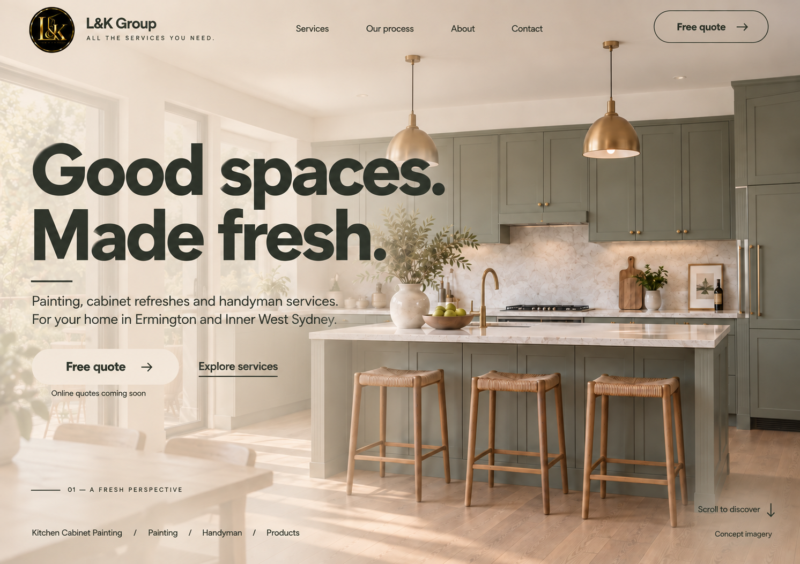

# 메인 첫 화면 — Olive / Ivory 시안 v3

2026-09-28 · 구현 전 이미지 검토 단계. 사용자가 파란 글자와 캐비넷 색의 조화를 지적하고 어울리는 색상 추천·적용을 요청했다.



## 색상 제안과 반영

- 글자·아이콘·선: 딥 올리브 차콜 `#30372F`. 사진의 회색빛 세이지 캐비넷과 같은 녹색 계열에서 명도를 낮추는 방향이다.
- 반투명 배경·버튼: 웜 아이보리 `#F4EFE5`. 밝은 대리석·따뜻한 목재·황동 조명과 연결한다.
- 작은 글자도 짙은 올리브를 유지한다. 대비가 약한 연한 세이지 보조 글자색은 적용하지 않았다.
- 사진 속 캐비넷 색·정면 구도·전체 배경 사진·텍스트 배치·기존 로고는 유지하는 색상 수정이다. 생성 편집 결과이며 픽셀 단위 동일성을 보장하지 않는다.
- 색상값은 생성 방향을 위한 제안값이다. 실제 구현에서는 CSS 토큰과 이미지 위 대비를 별도 확인한다.
- 이전 [v2](home-blue-beige-v2.md)는 비교용으로 보존한다.

## 산출물과 확인 범위

- 파일: `home-olive-ivory-v3.png`
- 기본 내장 `image_gen`으로 v2를 색상 편집했다.
- 색상안에 대한 별도 시각 검토를 거쳤으며 생성 결과의 올리브 글자, 사진 구도, 문구·컨셉 표기를 눈으로 확인했다.
- 웹페이지 코드·기능은 변경하지 않았다. 브라우저·반응형·접근성 검증 완료를 뜻하지 않는다.

## 최종 생성 프롬프트

```text
Use case: precise-object-edit / UI palette revision.
Edit the supplied L&K Group homepage mockup into ONE updated full-size desktop website concept image. Make a very targeted COLOR-ONLY revision. The user finds the blue text incompatible with the sage-gray cabinets. Replace the blue UI lettering and lines with a sophisticated DEEP OLIVE CHARCOAL drawn from the cabinetry's warm gray-green palette.

Exact palette direction:
- All large headline, logo wordmark text, navigation text, body copy, CTA labels, arrows, service links and fine decorative lines formerly blue: rich dark olive-charcoal #30372F. It should look like near-black warm green, NOT blue, teal, saturated emerald or bright green.
- Use the same dark olive for small text so it is clearly legible. Do not lower the contrast to pale sage.
- Preserve the light warm ivory/beige translucent photo veil, approximately #F4EFE5. Keep it translucent so the kitchen shows through, softly strongest behind left-hand copy and lighter on the right.
- Main CTA remains warm ivory with dark olive lettering. Top right pill remains a fine dark olive outline with dark olive lettering over the background. No major button shape changes.
- Existing small black-and-gold circular L&K logo is an exception: preserve its original black/gold appearance without recoloring.
- Keep cabinet paint the original muted warm sage-gray, with original brass pendants, marble surfaces, natural timber and daylight. Do not recolor or darken the kitchen to solve the color mismatch.

STRICT INVARIANTS:
Keep the exact same composition, single full-bleed kitchen photo behind all content, the transparent header, generous spacing, front-facing cabinets, island, all three woven stools, photograph framing and lighting, beige veil shape, text sizes, text positions, pill geometry and all content. No split layout. No separate opaque text panel or header bar. Do not redesign the scene, change the photograph perspective, move subjects, add/remove furniture, or alter the typography. Only replace the UI's blue pigment with dark olive-charcoal and harmonize the translucent beige subtly if needed.
Preserve every word verbatim, especially:
"L&K Group"
"ALL THE SERVICES YOU NEED."
"Services" "Our process" "About" "Contact"
"Good spaces."
"Made fresh."
"Painting, cabinet refreshes and handyman services."
"For your home in Ermington and Inner West Sydney."
"Free quote"
"Explore services"
"Online quotes coming soon"
"01 — A FRESH PERSPECTIVE"
"Kitchen Cabinet Painting / Painting / Handyman / Products"
"Scroll to discover"
"Concept imagery"

High-fidelity clean screenshot of a polished website design. Crisp beautifully rendered typography. Same landscape aspect and dimensions as supplied input. Output only ONE updated image, no surrounding palette chart, annotations, swatches, before-and-after, device frames or extra labels. The result should feel harmonious with the cabinet paint, understated and warm, with clearly readable dark olive text over warm ivory and natural kitchen photography.
```

