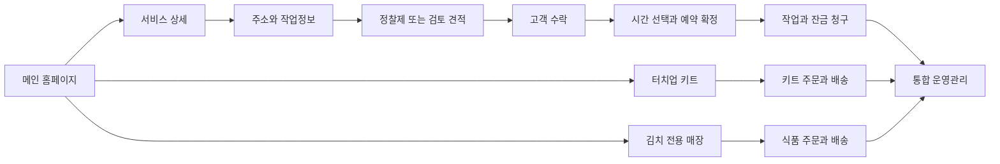

# 화면과 고객 여정

## 사이트 구조

처음에는 하나의 도메인과 Next.js 프로젝트로 운영한다. 메인과 상품 페이지는 URL·화면·업무 모듈을 구분하지만 데이터와 로그인을 공유한다. 별도 도메인은 브랜드 인지도와 식품 사업 규모가 검증된 뒤 결정한다. 다음 URL은 제안 경로이며 도메인 소유권을 가정하지 않는다.

```text
/
├── /about
├── /services
│   ├── /handyman
│   │   ├── /silicone-resealing
│   │   ├── /door-repairs
│   │   ├── /flyscreen-replacement
│   │   ├── /wall-mounting
│   │   └── /tile-replacement
│   ├── /painting/interior
│   ├── /painting/exterior
│   └── /cabinet-painting
├── /service-areas
├── /quote/start
├── /booking
├── /products
│   ├── /touch-up-kits
│   └── /touch-up-kits/[slug]
├── /kimchi
│   └── /[slug]
├── /cart/kits  /cart/kimchi
├── /checkout  /order/confirmation
├── /projects/[slug]  /guides/[slug]
├── /contact  /faq
├── /account/quotes  /account/bookings  /account/orders
├── /policies/privacy  /policies/terms
├── /policies/shipping  /policies/returns
└── /admin
```

관리자와 고객 페이지는 검색 제외하고 서버에서도 권한을 검사한다. noindex나 숨겨진 URL은 보안 수단이 아니다. 기존 공개 URL이 있다면 실제 목록을 확보한 뒤 301 매핑한다. 확인되지 않은 URL에 임의 리다이렉트를 만들지 않는다.



## 페이지별 구성

| 화면 | 첫 화면에서 답할 질문 | 주요 구성과 행동 |
| --- | --- | --- |
| 메인 | 어떤 도움을 받을 수 있는가 | 집수리·페인팅·키트·김치 분기, 실제 작업 사례, 지역 확인 |
| 서비스 카테고리 | 내 작업이 포함되는가 | 제공 범위, 작업 카드, 제외 작업, 상담 버튼 |
| 서비스 상세 | 얼마이며 무엇이 포함되는가 | 가격 조건, 전후 사진, 포함·제외, 예상 시간, 보증·FAQ, Get a Quote |
| 견적 | 무엇을 제출해야 하는가 | 주소 → 작업 수량 → 사진 → 연락처 → 결과, 임시 저장 |
| 수락 | 무엇에 동의하는가 | 고정된 버전·총액·세금·범위·유효기간·약관, 명시적 수락 |
| 예약 | 언제 작업 가능한가 | 작업 또는 현장방문 구분, 시간대, 예약금, 취소·변경 조건 |
| 키트 상세 | 내가 쓸 색과 구성이 맞는가 | 구성품·용량·옵션·색상 정보·납기·배송·사용법 |
| 김치 상세 | 먹을 수 있고 배송받을 수 있는가 | 성분·알레르겐·중량·보관·배송지역·날짜·유통기한 기준 |
| 관리자 첫 화면 | 오늘 무엇을 처리해야 하는가 | 검토 대기, 오늘 작업, 미출고, 재고 경고, 미수금, 자동화 실패 |

김치는 페인트 이미지·공구 아이콘과 분리된 전용 화면을 갖는다. 그룹 관계는 푸터의 사업자 안내로 명확히 하고, 식품 페이지의 주요 메뉴와 추천상품은 식품 중심으로 유지한다. 시공 고객에게 김치 마케팅을 보내려면 별도 관심·동의가 필요하다.

## 모바일 사용 조건

375px 화면에서 주소·가격·다음 버튼이 잘리면 안 된다. 단계마다 제목, 진행 상태, 이전 버튼을 제공한다. 사진은 모바일 카메라·갤러리 모두 지원하고 HEIC는 서버에서 안전하게 변환하는 방안을 검증한다. 업로드 실패 시 기존 입력을 보존한다.

고정 하단 버튼은 쿠키 안내, 키보드, 오류 메시지와 겹치지 않게 한다. 색상만으로 오류를 표현하지 않고 필드별 설명과 요약을 표시한다. 예약 시간은 Sydney 현지 시간과 날짜를 보여주며, 직원 화면은 야외에서도 읽히는 대비와 큰 터치 영역을 제공한다. WCAG 2.2 AA를 제품 목표로 두고 키보드·스크린리더의 핵심 흐름을 검증한다.

## 주요 예외 화면

- 주소 밖: 자동예약 불가를 알려주고 문의 전환. 예외 승인은 담당자와 사유를 기록한다.
- 주소 불명확: 아파트·유닛 번호 보완 또는 수동 검토. 비용 청구 전 해결한다.
- 사진 부족: 필요한 추가 사진의 구도를 예시로 안내하고 상담 방식 제공.
- AI 대기: 제출 내용을 저장하고 처리 결과를 이메일로 안내. 실패해도 문의는 사라지지 않는다.
- 품절: 결제 진입 차단, 대체 상품 또는 동의 기반 입고 알림.
- 김치 배송 불가: 결제 전 차단, 가능한 픽업이 실제 있을 때만 제시.
- 결제 후 확인 지연: 중복 결제를 유도하지 않고 주문번호와 확인 중 상태를 제공.

## 콘텐츠 관리 기준

관리자는 페이지 제목, 요약, 본문, 사진 대체텍스트, FAQ, SEO 제목·설명, 공개 여부를 수정한다. HTML 임의 입력은 제한된 편집기로 정화한다. 가격과 예약 규칙은 일반 본문이 아닌 승인된 카탈로그에서 불러와 불일치를 줄인다.

영어를 초기 언어로 하고 한국어는 번역 승인 후 명시적 locale 경로로 도입한다. 이때 영문 기존 URL 정책, canonical, hreflang, sitemap을 함께 정한다. 자동번역만으로 계약·알레르겐·반품 정책을 게시하지 않는다.
