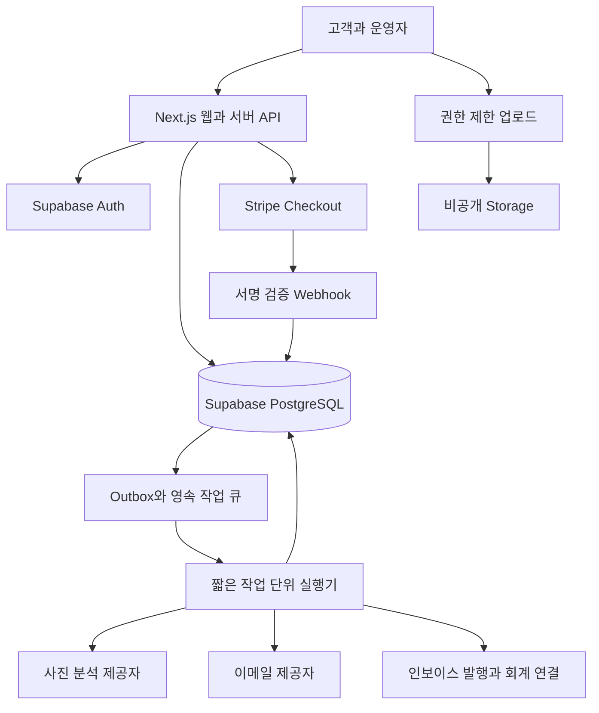

# 기술 구조와 배포 계획

## 권장 구성

2026-09-27 착수 변경: Day 2 메인 프로토타입은 외부 연결 없이 로컬 Next.js로 만든다. Vercel·Supabase는 회사 측 이메일·승인 후 그 회사 계정으로 연결한다. 아래 클라우드 구성은 연결 단계의 기준이며 현재 생성·연결 완료를 뜻하지 않는다. 현재 구현 범위는 [메인 실행 명세](17-home-prototype-design-plan.md)를 따른다.

Next.js와 TypeScript로 공개 홈페이지·쇼핑몰·고객 화면·관리자를 구현하고, Supabase의 PostgreSQL·Auth·Storage를 사용한다. 결제는 Stripe Checkout을 기본안으로 두며, 이메일·주소 검색·회계 도구는 교체 가능한 연결 모듈로 만든다. 초기에는 하나의 저장소 안에서 업무별 모듈을 분리하는 구조가 적합하다.



DB는 고객·견적·주문·재고 상태의 원본이다. Stripe는 결제 거래의 원본이고 DB에 검증된 결제 상태를 복제한다. 외부 회계를 도입하면 법정 인보이스 번호의 원본을 어느 시스템으로 할지 한 곳으로 정한다. 이메일은 상태 변경의 결과이며 데이터 원본이 아니다.

## 구성요소 선택과 이유

| 영역 | 기본안 | 구현 원칙 |
| --- | --- | --- |
| 공개 화면 | Next.js App Router | 검색 가능한 서비스 콘텐츠, 공용 페이지 캐시 |
| 개인·관리 화면 | Next.js 서버 인증 | 개인정보 응답 공용 캐시 금지, 모든 변경 서버 검증 |
| DB | Supabase PostgreSQL | 트랜잭션, 제약조건, RLS, 데이터 마이그레이션 |
| 인증 | Supabase Auth | 고객 이메일 인증, 직원 초대, 관리자 MFA |
| 사진 | Supabase Storage | 비공개 버킷, 짧은 서명 URL, 확장자·실제 파일 검사 |
| 결제 | Stripe Checkout | 카드정보 직접 저장 없음, 결제 성공은 Webhook으로 확정 |
| 작업 큐 | DB outbox + Supabase Queues 또는 동일 수준의 영속 큐 | 한 번 이상 전달을 가정하고 중복 안전 처리 |
| 이메일 | Resend 또는 동등 제공자 | 전송·반송 이벤트, 도메인 인증, 공급자 변경 가능 |
| 주소 | Google 주소 자동완성 후보 | 서버에서 주소 검증, 저장·표시 정책 사전 확인 |
| 배포 | Vercel | Preview·Staging·Production 분리, 배포 승인 기록 |
| 개발 환경 | 로컬 Next.js + Supabase Cloud 테스트 프로젝트 + Supabase CLI | 테스트·운영 DB 분리, DB 변경 파일 관리. Docker는 필요 시 사용 |

의존성은 착수 시 지원 중인 안정 버전을 확인해 lockfile과 런타임 버전으로 고정한다. 이 문서에 과거 Next.js 최신 버전을 추정해 박아 넣지 않는다. 공식 배포 설명은 [Next.js 배포 문서](https://nextjs.org/docs/app/getting-started/deploying)를 참조한다.

## Docker와 Vercel의 역할

2026-09-27 사용자 결정에 따라 Docker는 초기 필수 설치에서 제외한다. 메인·Cabinet 개발은 Supabase Cloud의 테스트 프로젝트로 시작한다. Coatly DB 이식, 반복 초기화·권한 테스트 등 로컬 Supabase 실행이 필요해질 때 Docker를 설치·사용한다.

2026년 9월 확인한 공식 안내상 Vercel은 OCI 컨테이너 이미지를 Functions로 실행하는 배포를 지원한다. 따라서 Docker 자체를 지원하지 않는다고 가정하지 않는다. 다만 컨테이너 함수는 영속 상태를 외부 저장소에 두어야 하며 실행 시간 등 함수 제한을 받는다. [Vercel Docker 안내](https://vercel.com/kb/guide/does-vercel-support-docker-deployments)

기본 Next.js 앱은 Vercel의 표준 Next.js 배포를 사용한다. Docker는 로컬 환경·CI 재현·특수 이미지 처리 작업에 필요한 경우 선택적으로 활용한다. 필요하면 별도의 HTTP 기반 이미지 처리 컨테이너를 배포하되 무기한 실행되는 백그라운드 프로세스에 의존하지 않는다. 작업을 나누기 어려운 장시간 처리만 별도 관리형 컨테이너 호스트를 검토한다.

로컬 Docker Compose의 전체 스택을 Vercel에 그대로 올리는 계획은 세우지 않는다. Compose는 로컬에서 쓰고, 운영 DB는 Supabase Cloud를 사용한다. [Vercel Compose 설명](https://vercel.com/i/can-you-run-docker-compose-on-vercel)

## 업무 모듈과 저장소 제안

사용자 요청으로 DDD 모듈형 모놀리스를 기준으로 한다. 각 업무 모듈은 필요한 `domain / application / infrastructure / presentation`과 공개 진입점으로 구성한다. 도메인은 프레임워크·DB를 모르며 구현 의존성은 조립 지점에서 연결한다. 재사용 가능한 모듈과 공통 UI를 구분하고 실제 요구가 없는 빈 계층·미래 모듈은 만들지 않는다. 아래 목록은 전체 확장 지도이며 초기 메인에서 전부 생성하지 않는다.

```text
src/app/                 공개·고객·관리자 라우트
src/modules/catalog/     서비스·상품·콘텐츠
src/modules/quotes/      견적·가격표·수락
src/modules/bookings/    가용 시간·배정·작업
src/modules/commerce/    장바구니·주문·반품
src/modules/inventory/   재고·배치·BOM
src/modules/billing/     결제·환불·인보이스
src/modules/customers/   고객·조직·동의
src/integrations/        Stripe·이메일·주소·AI·회계
src/jobs/                큐 처리와 재시도
supabase/migrations/     구조·제약·권한 변경
supabase/tests/          DB·권한·동시성 검증
tests/                   단위·통합·E2E
docs/                    계획·운영·결정·검증 기록
```

가격 계산과 재고 차감은 UI에서 분리된 도메인 로직과 DB 트랜잭션으로 만든다. 고객 요청의 가격·할인·세금·직원 ID를 그대로 믿지 않는다. 공개 상품 조회와 금전·재고 변경은 다른 권한 경로로 분리한다.

## 환경과 CI

회사 승인 전 로컬 메인은 DB·키 없이 실행한다. 아래 테스트 DB·환경 분리는 연결 승인 이후부터 적용한다.

로컬 개발 앱은 Supabase Cloud 테스트 프로젝트에 연결하며 합성 데이터만 사용한다. Docker를 도입해 로컬 DB를 실행하는 경우에도 같은 원칙을 적용한다. Staging과 Production은 별도 Supabase 프로젝트와 Stripe 모드, 메일 발신 설정을 갖는다. Preview 배포는 운영 DB와 실제 고객 메일에 접근하지 못한다. 승인된 테스트 수신자만 허용한다.

PR에서 타입 검사·정적 검사·핵심 단위 테스트·DB 권한 테스트·빌드·주요 E2E를 수행한다. DB 변경은 확장 후 이전 후 제거하는 순서로 배포해 구버전 웹과 동시에 동작하게 한다. 앱 롤백이 DB 데이터를 과거로 되돌린다고 가정하지 않는다. 운영 배포 전 백업·마이그레이션·복구 방법을 함께 승인한다.

## 비동기 작업의 신뢰성

업무 레코드 변경과 outbox 이벤트 생성은 같은 DB 트랜잭션에 넣는다. 소비자는 event_id를 기록하며 동일 업무를 재처리해도 결과가 중복되지 않는다. 이메일·AI·외부 회계 호출은 DB 트랜잭션 밖에서 실행한다. HTTP 응답을 보낸 뒤 메모리 타이머로만 작업을 이어가지 않는다.

재시도는 지수 대기·최대 횟수·처리 중 임대시간·실패 큐를 갖는다. 예시 정책은 1분·5분·30분 후 재시도, 이후 운영자 작업 생성이다. 외부 결제의 일시적 지연과 영구 입력 오류는 서로 다르게 분류한다.

## 데이터 위치와 비용 제어

Supabase와 Vercel 실행 지역은 호주 이용자 지연과 사용 가능한 지역을 확인해 가까이 배치한다. 호주 DB 선택만으로 이메일·AI·결제까지 호주 내 처리라고 설명하지 않는다. 공급자별 처리·보관 국가를 개인정보 문서에 기록한다.

API별 월 예산·일일 건수·고객별 제한·사진 크기 한도를 둔다. 비용 경보 50%·80%·100%와 AI 비활성화 스위치를 제안한다. 지출 제한으로 유료 주문 확인까지 끊지 않도록 중요 결제 경로와 부가 분석 경로를 분리한다.
