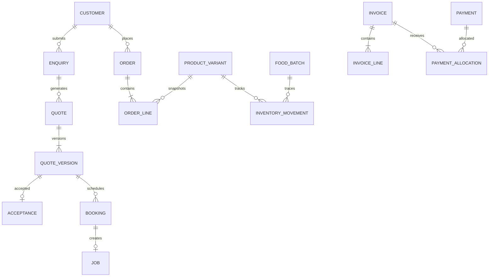

# 데이터 모델과 권한

## 공통 규칙

고객·상품·주소의 현재 값과 거래 시점의 값을 구분한다. 견적·주문·인보이스에는 이름·주소·품목·가격·세금·약관 버전의 스냅샷을 보관한다. 상품 이름이나 가격이 바뀌어도 과거 거래 내용은 바뀌지 않는다.

금액은 AUD 기준 센트 정수, 수량은 단위가 명시된 정밀 소수 또는 정수로 저장한다. 일시는 UTC의 timestamptz, 표시·예약 규칙은 Australia/Sydney로 처리한다. 여름시간을 고정 UTC+10으로 계산하지 않는다. 기록에는 id, created_at, updated_at, actor_id와 필요한 version을 둔다.

## 핵심 테이블

| 영역 | 테이블 후보 | 주요 필드와 제약 |
| --- | --- | --- |
| 사업 | legal_entities, business_units | 법인·ABN·GST 상태, services/kits/food, 유효기간 |
| 고객 | customers, customer_auth_links, customer_organisations | 고객 ID, 인증 계정 연결, 회사 청구처; 이메일만으로 무조건 병합 금지 |
| 주소 | customer_addresses, service_area_checks | 고객 입력 주소, 검증 결과, 정책 버전, 만료 시점 |
| 동의 | consent_events | 대상 사업·채널·목적·문구 버전·시각·철회; append-only |
| 권한 | staff_memberships, job_assignments | 서버 관리 역할, 사업 단위, 작업 배정, 활성 여부 |
| 서비스 | service_categories, services, service_options | slug 유일, 작업 단위·기본 시간·승인 상태 |
| 가격표 | price_books, price_rules | 버전·유효기간·단위·포함 작업·세금 코드·중복 그룹 |
| 문의 | enquiries, enquiry_items, enquiry_photos | 상태·고객·서비스·사진 키; 사진 공개 URL 저장 금지 |
| AI | ai_assessments, damage_observations | 모델·프롬프트·스키마 버전, 관찰·근거·평가·검토 결과 |
| 견적 | quotes, quote_versions, quote_lines, quote_acceptances | quote+version 유일, 총액 hash, 서명 시각·약관 hash |
| 예약 | bookings, booking_resources, availability_rules, slot_holds | 견적 버전, 작업·방문 유형, 시작·종료·버퍼·만료 |
| 현장 | jobs, job_tasks, job_photos, variations | 작업 상태, 배정, 완료 증거, 변경 승인 |
| 카탈로그 | products, product_variants, product_options | SKU 유일, 사업 단위, 배송 그룹, 세금 코드 |
| 제조 | kit_bom, production_orders, artwork_approvals | BOM 버전·구성 수량, 제작 상태, 승인 버전 |
| 식품 | food_batches, batch_quality_checks | 제조일·기한·로트·판매 가능 상태·알레르겐 버전 |
| 재고 | inventory_locations, inventory_movements, inventory_reservations | 이동 원장, 예약 만료, SKU·배치·수량·원인 |
| 주문 | carts, orders, order_lines, fulfilments, returns | 품목 스냅샷, 상태, 배송 그룹, 반환·폐기 구분 |
| 결제 | payment_attempts, payments, payment_allocations, refunds | provider ID 유일, 통화·금액, 청구 배분, 환불 한도 |
| 청구 | invoices, invoice_lines, credit_notes | 법인+문서번호 유일, 발행 후 수정 제한 |
| 자동화 | webhook_events, outbox_events, job_attempts, message_deliveries | provider+event_id 유일, 시도·오류·처리 결과 |
| 감사 | audit_events, reconciliation_runs | 행위자·사유·변경 요약·관련 ID; 삭제 제한 |

모든 테이블을 한 번에 개발하지 않는다. A에서 고객·가격·견적·예약·청구·이벤트를 만들고, B에서 상품·재고, C에서 AI 평가·식품 배치·원가 보고를 추가한다. legal_entity는 단일 법인이어도 거래 시점 판매자를 명확히 하는 필드로 유지한다.

## 관계

## 금액과 재고의 불변 조건

1. order_total = 품목 순액 + 세금 + 배송 - 적용 가능한 할인. 반올림 단위·순서를 고정하고 인보이스와 공유한다.
2. 과세 품목과 GST-free 품목은 세금 코드를 따로 가진다. 배송·할인 배분도 회계 검토된 규칙을 사용한다.
3. 동일 결제 provider ID는 한 번만 기록된다. 환불 총액은 결제 성공액을 넘지 못한다.
4. invoice_amount_due = 발행액 - 크레딧 - 유효 입금 배분. 입금 배분 합은 결제 잔액을 넘지 못한다.
5. 판매 가능 수량 = 판매 허용 실재고 - 유효 예약. 격리·만료·회수 배치는 제외한다.
6. 재고 이동은 입고·출고·반품·폐기·조정으로 누적한다. 단순 수량 덮어쓰기 대신 사유 있는 원장 항목을 쓴다.
7. 동일 직원의 유효 예약 시간과 버퍼가 겹치지 않는다. multi-day 캐비넷 작업은 각 작업·건조·공방 리소스를 별도 점유한다.
8. 수락된 견적은 불변이다. 변경은 새 버전 또는 variation으로 고객의 추가 수락을 받는다.

## 상태 전이

| 객체 | 주요 정상 경로 | 예외 경로 |
| --- | --- | --- |
| 문의 | submitted → reviewing → quoted → closed | needs_info, out_of_area, spam |
| 견적 버전 | draft → approved → sent → accepted | rejected, expired, superseded |
| 예약 | held → payment_pending → confirmed → completed | expired, cancelled, reschedule_requested |
| 작업 | scheduled → in_progress → completion_review → completed | blocked, variation_pending, rework |
| 주문 | pending_payment → paid → processing → fulfilled | payment_failed, cancelled, partially_refunded, refunded |
| 식품 배치 | pending_release → available → depleted | quarantine, expired, recalled |
| 인보이스 | draft → issued → partially_paid → paid | void(허용 조건), overdue, credit_issued |

사용자 화면의 라벨과 내부 상태는 구분한다. 상태 변경 함수는 이전 상태·행위자·버전·선행 조건을 검사하고 불법 전이는 오류로 반환한다. paid 이전 주문을 출고할 수 없고 사진 AI 결과가 도착했다는 사실만으로 accepted로 전이할 수 없다.

## 접근 제어

| 역할 | 읽기 | 변경 |
| --- | --- | --- |
| 비회원 | 공개 카탈로그 | 제한된 문의 제출·결제 세션 생성 API |
| 고객 | 인증 연결된 본인 거래 | 본인 주소·동의·견적 수락·변경 요청 |
| 현장 직원 | 배정 작업의 최소 고객정보 | 해당 작업의 상태·사진·자재 사용 |
| 식품 담당 | 식품 주문·배치·배송 | 입고·검수·배치 할당·출고 |
| 운영 관리자 | 허용 사업 단위 거래 | 견적 검토·일정·문의·재고 조정 |
| 회계 | 청구·입금·크레딧 | 회계 연결·정산·승인된 환불 |
| 대표 | 전체 사업 보고 | 가격표 승인·권한·정책 |

공개 스키마는 최소 GRANT와 RLS를 함께 적용한다. 권한은 사용자가 바꿀 수 있는 user_metadata에 보관하지 않는다. 직원 퇴사나 권한 축소는 서버 membership 조회로 민감 작업에 즉시 반영한다. 서비스 비밀키는 서버 전용이며, 비밀키를 사용하는 함수도 자체 권한 검사를 수행해야 한다. [Supabase RLS](https://supabase.com/docs/guides/database/postgres/row-level-security)

비회원 주문 열람은 추측 가능한 주문번호만으로 허용하지 않는다. 이메일 OTP 또는 짧은 수명·해시 저장 토큰으로 검증하고, 이후 해당 고객 계정 연결은 추가 소유 확인을 거친다. 이메일 변경은 다른 사람의 과거 주문을 자동으로 가져오는 계기가 되어서는 안 된다.

## 색인과 데이터 이동

customer_id+created_at, 상태+생성일, 직원+시간 범위, SKU+location+batch, provider_event_id, quote_id+version에 조회·유일성 색인을 설계한다. 결제·예약·재고의 경합은 행 잠금과 DB 제약으로 해결한다. 반복 처리에는 업무별 idempotency_key를 요구한다.

기존 엑셀 자료가 제공되면 샘플 20행 매핑 → 중복·단위 검증 → staging import → 금액·수량 대조 → 승인 후 import 순으로 진행한다. 원본과 import_batch_id를 유지하며, 실제 이관 자료가 없는 현재 단계에서는 합성 seed만 설계한다.
